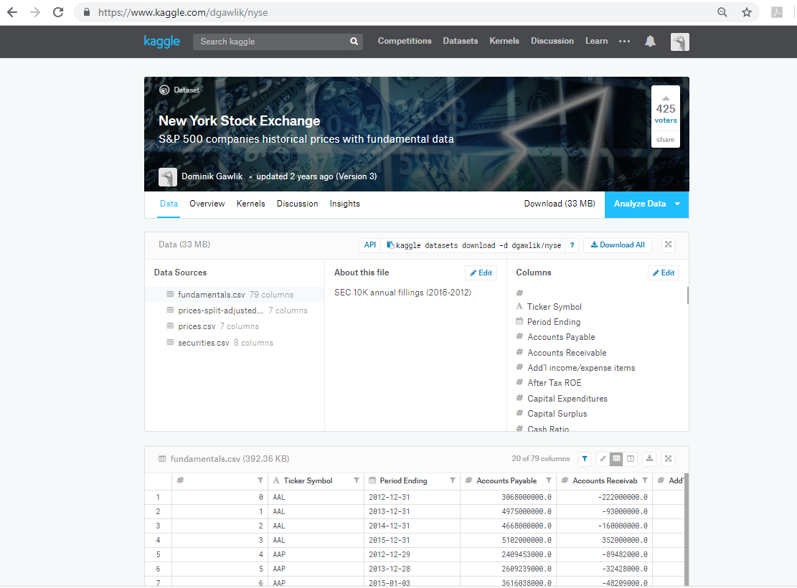

# Project Overview

## Kaggle's New York Stock Exchange S&P 500 dataset

#### Introduction

#### Why this Project?

This project will introduce you to the data analysis process that you will be using throughout the rest of the Nanodegree program. In this project, you will go through the process of calculating summary statistics, drawing an inference from the statistics, calculating business metrics and using models to forecast future growth prospects for the companies. The goal is for you to perform an analysis and also create visual tools to communicate the results in informative ways.

We have provided a clean data set for this project. Although in real life scenarios, data sets often need to be cleaned and processed before analysis can proceed. This project allows you to see what a clean data set should look like.

#### What skills will I use?

The main goal of this project is for you to demonstrate your ability to:

     * interpret the measures of central tendency and spread (mean, median, standard deviation, range).

 

